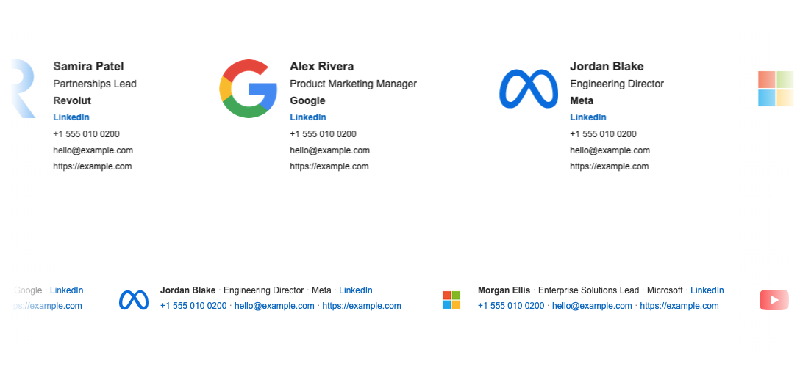

<div>
<h3>Email Signature Editor</h3>
<p>Edit HTML email signatures with a live preview, then copy into Gmail.</p>
<a href="https://email-signature-editor.pages.dev/">→ Live demo</a>
</div>

<br/><br/>

<div align="center">

[](https://www.typescriptlang.org/)
[](https://github.com/xarlizard/email-signature-editor/blob/main/LICENSE)
[](https://github.com/xarlizard/email-signature-editor/actions/workflows/ci.yml)
[](https://email-signature-editor.pages.dev/)

<br/>
<br/>

<br/>

</div>

<hr>

## Features

### Home

- **Landing page** (`/`) – Product overview, animated signature showcase, and quick links to create a signature or browse templates

### Signature editor

- **Library** (`/signatures`) – Saved signatures in the browser (localStorage), card previews, create new or open an existing one
- **Guided flow** (`/signatures/edit`) – Choose a template, fill fields step by step, then review with **Copy for Gmail** / **Copy HTML** / **Save**
- **Template picker** – Visual previews for each built-in template before entering field steps

### Template editor

- **Template library** (`/templates`) – Built-in layouts plus saved custom templates; duplicate any template to customize
- **Visual builder** (`/templates/edit`) – Edit template name, image settings, global text defaults, and row/field layout
- **Per-field styling** – Override font, color, size, and style for individual fields
- **Live HTML + preview** – Generated markup and rendered preview stay in sync; copy for Gmail or raw HTML

### Shared

- **Schema-driven templates** – Modern, Minimal, and Compact built-ins; HTML generated from structured template data
- **Copy** – Rich HTML for Gmail where supported, plus plain HTML string copy
- **Internationalization** – English, Spanish, French, German, Italian, Dutch, Catalan, Russian, Chinese
- **Theme** – Light / dark
- **UI** – React, Vite, TypeScript, Tailwind CSS, shadcn/ui

Use the header navigation to move between **Home**, **Templates**, and **Signatures**.

---

## Screenshots

<div align="center">

### Signature library

The **Signatures** page lists your saved signatures. Open any card (live preview, title, and timestamp) or start the creation flow with **Create new signature**.

<br/>

### Signature editor – review

At the end of the guided flow, after choosing a template and filling in your details, the **Review** step shows a full preview. From here you can **Copy for Gmail**, **Copy HTML**, or **Save** back to the library.

<br/>

### Template editor

The **template editor** shows generated **HTML** beside a **live preview**. Adjust template attributes, rows, and per-field styles; the preview updates as you work.

<br/>

</div>

---

## Quick Start

**[Try it online](https://email-signature-editor.pages.dev/)** or run locally:

```bash
npm install
npm run dev
```

Open [http://localhost:5173](http://localhost:5173) in your browser.

---

## Usage

### Create a signature

1. From the home page, click **Create signature**, or open **Signatures** in the header
2. Create a new signature or open a saved one
3. **Choose a template**, then complete each field in the guided flow
4. On **Review**, copy for Gmail or copy HTML, and **Save** to the library if you want

### Customize a template

1. Open **Templates** in the header
2. Pick a built-in layout or a saved template, or duplicate one to start from a copy
3. In the **template editor**, adjust attributes, rows, and per-field styles
4. **Save** your template, then use it when creating signatures

### Paste into Gmail

1. Copy your signature from the review step or preview panel
2. In Gmail: **Settings** → **See all settings** → **General** → **Signature** → paste

---

## Scripts

| Script              | Description                  |
| ------------------- | ---------------------------- |
| `npm run dev`       | Start development server     |
| `npm run build`     | Build for production         |
| `npm run preview`   | Preview production build     |
| `npm run lint`      | Run ESLint                   |
| `npm run typecheck` | Run TypeScript type check    |

---

## Project structure

```
src/
├── pages/
│   ├── home/               # Marketing landing page
│   ├── signatures/         # Signature library
│   ├── signatures-edit/    # Guided signature editor (wizard)
│   ├── templates/          # Template library
│   └── templates-edit/     # Visual template editor
├── components/             # Shared UI (header, forms, panels)
├── contexts/               # App state (signatures, templates)
├── lib/
│   ├── templates/          # Built-in templates + HTML builder
│   ├── templateRows.ts     # Row/field helpers
│   └── i18n/locales/       # Translation JSON files
├── routes/                 # React Router config
└── types/                  # Shared TypeScript types
```

---

## Development

- Clone: `git clone https://github.com/xarlizard/email-signature-editor.git`
- Install: `npm install`
- Dev: `npm run dev`
- Build: `npm run build`

---

## Contributing

Contributions are welcome. Please open [issues](https://github.com/xarlizard/email-signature-editor/issues) or [pull requests](https://github.com/xarlizard/email-signature-editor/pulls).

---

## License

MIT © [xarlizard](https://github.com/xarlizard)
